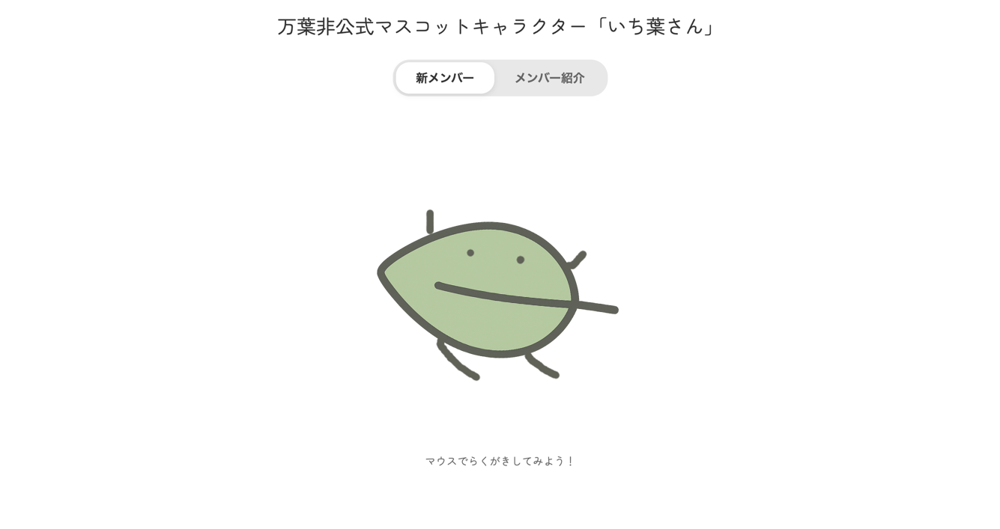
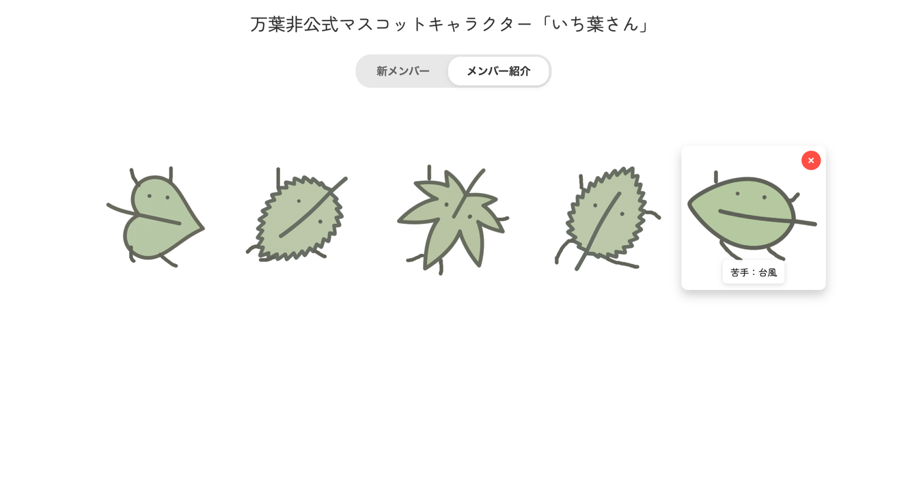
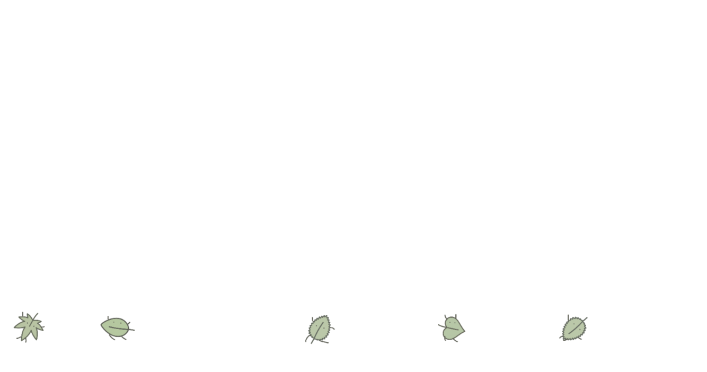

# 万葉非公式マスコットキャラクター「いち葉さん」をつくろう

万葉の非公式マスコットキャラクター「いち葉さん」を自由にカスタマイズして作成できるWebアプリケーションです。

## 🎨 概要

葉っぱに落書きをして、あなただけのオリジナル「いち葉さん」を作成できます。
作成したキャラクターは画面下でわらわらと動き回ります。

## ✨ 機能

- **キャラクター作成**: 葉っぱベースの画像に自由に落書きできます
  - マウスやタッチ操作に対応
  - 5種類の葉っぱ画像からランダムに選択
  - ランダムな回転角度で個性的なキャラクターに

- **キャラクター管理**:
  - 作成したキャラクターをブラウザ内に保存
  - ギャラリーで一覧表示
  - 各キャラクターには個性的な紹介文が自動付与
  - 削除機能

- **わらわらアニメーション**:
  - 画面下部でキャラクターが自律的に動き回る
  - マウスカーソルに反応して逃げる
  - クリックでジャンプ
  - 落下アニメーション付きで新規キャラクターが仲間入り

## 🚀 使い方

1. `ruby -run -e httpd . -p 8080`でサーバーを立ち上げる
1. ブラウザで http://127.0.0.1:8080 ニア癖雨
2. 「新メンバー」タブで葉っぱに落書き
3. 「採用」ボタンでキャラクター完成
4. 「メンバー紹介」タブで作成したキャラクターを確認
5. 画面下部のキャラクターをクリックしてジャンプさせたり、マウスで追いかけたりして遊ぶ

## 🛠️ 技術スタック

- HTML5
- CSS3
- JavaScript (Vanilla)
- HTML5 Canvas API
- LocalStorage

## 📁 ファイル構成

```
.
├── index.html       # メインHTMLファイル
├── style.css        # スタイルシート
├── script.js        # JavaScriptロジック
└── img/            # 葉っぱ画像（5種類）
    ├── leaf1.png
    ├── leaf2.png
    ├── leaf3.png
    ├── leaf4.png
    └── leaf5.png
```

## 📝 特徴

- **完全クライアントサイド**: サーバー不要、ブラウザだけで動作
- **レスポンシブ**: PC・スマホ・タブレット対応
- **データ永続化**: LocalStorageでキャラクターを保存
- **物理演算**: 重力、摩擦、バウンスなどリアルな動き

## 🎯 開発情報

- **イベント**: 2025ハッカソン
- **開発者**: 高田
- **リポジトリ**: hc2025_atakada
